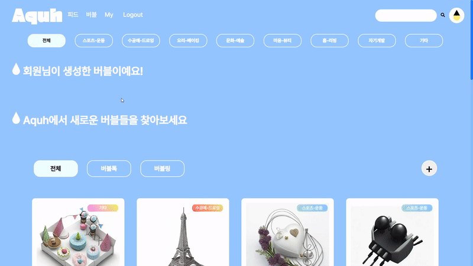
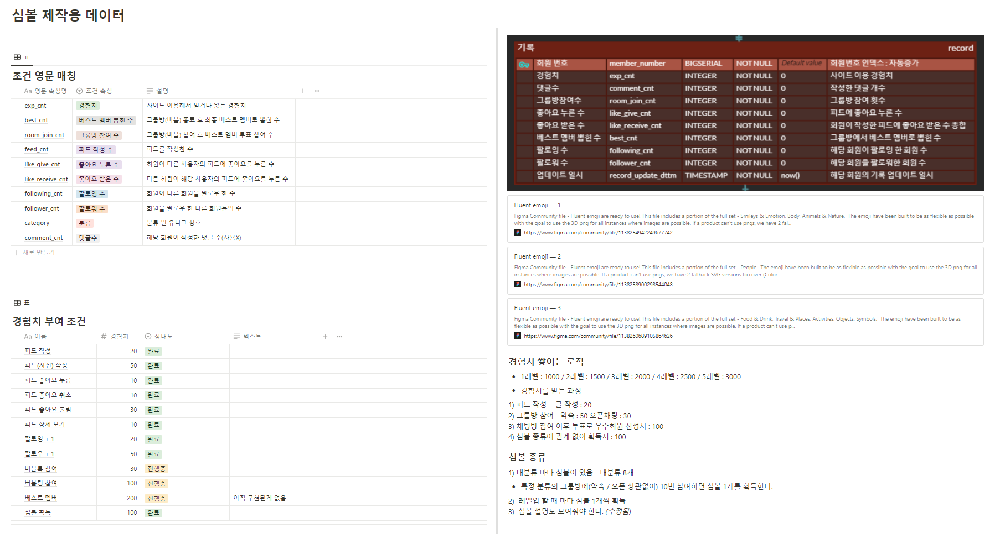
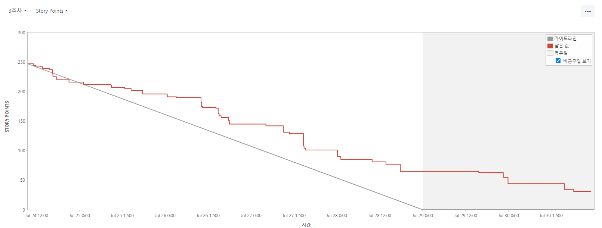

### 목차

| [소개](#소개)                               | [구현](#구현)                                           | [마치며](#마치며)                           |
| :------------------------------------------ | :------------------------------------------------------ | :------------------------------------------ |
| [:book: 개요](#book-개요)                   | [:dart: 주요 페이지 및 기능](#dart-주요-페이지-및-기능) | [:boy: 팀원](#boy-팀원)                     |
| [:bulb: 프로젝트 기획](#bulb-프로젝트-기획) | [:rocket: 기능시연](#rocket-기능시연)                   | [:mega: 소감](#mega-소감)                   |
| [:cactus: 빌드 환경](#cactus-빌드-환경)     | [:eyes: 산출물](#eyes-산출물)                           | [:seedling: 회고 기록](#seedling-회고-기록) |
|                                             | [:books: 파일 구조도](#books-파일-구조도)               |                                             |

<br/>

# 소개

## :book: 개요

**_👏 SSAFY 9기 2학기 공통 프로젝트 👏_**  
WEB-RTC 기술을 활용한 서비스를 개발해보자

> 2023.07.10 ~ 2023.08.18 (6주)

<br/>

[🔼 목차로 돌아가기](#목차)

<br/>

## :bulb: 프로젝트 기획

### UCC

[](https://youtu.be/Zh_-gMzXWlM?si=D7H7h3-iD1eQSzJx)

<br/>

### 배경

**"취미를 공유하려면 꼭 만나야해? 너무 부담스러운데..."**

> 기존의 취미 공유 서비스들은 오프라인 모임을 전제로 서비스하기 때문에 낯선 사람과의 만남이 부담되고 시간을 보다 더 많이 투자하게 되는 단점이 있습니다.
> Aquh에서는 가볍게 다양한 취미를 공유 할 수 있습니다.

**"화상 화면으로도 충분히 함께 할 수 있는 취미도 많은 것 같은데!"**

> 뜨개질, 드로잉 등의 공예 분야 취미나 축구, 농구 등 야외 스포츠 운동이더라도 도구/옷 착용법이나 구매 전 비교 등 온라인 정보 공유 만으로 충분한 경우들이 있습니다.

**"이런 취미는 같이 할 만한 사람들이 없네..."**

> 대중적으로 많이 즐기는 취미가 아닌, 자신만의 특별한 취미나 잠깐 관심이 생긴 분야를 가볍게 접하는 용도로 Aquh를 이용할 수 있습니다.
> AI 썸네일 생성으로 쉽게 특별한 취미를 나타낼 수 있습니다.

<br/>

[🔼 목차로 돌아가기](#목차)

<br/>

## :cactus: 빌드 환경

| FrontEnd                | BackEnd                                      | Database   | Infra                      |
| :---------------------- | :------------------------------------------- | :--------- | :------------------------- |
| Node.js 18.16.1         | Java 17 (Azul Zulu version 17.0.7)           | PostgreSQL | AWS EC2 (Ubuntu 20.04 LTS) |
| React.js 18.2.0         | Spring Boot 3.1.1                            | Dbeaver    | AWS S3 Bucket              |
| react-dom 18.2.0        | Gradle 8.1.1                                 | Redis      | Nginx 1.18.0               |
| react-icons 4.10.1      | JPA                                          | MongoDB    | Jenkins 2.401.2 LTS        |
| react-modal 3.16.1      | IntelliJ IDEA 2023.1.3<br>(Ultimate Edition) |            | Docker 23.0.6              |
| react-router-dom 6.14.2 | lombok                                       |            | Docker Compose 2.17.3      |
| react-scripts 5.0.1     | mail                                         |
| react-select 5.7.4      | JWT                                          |
| Axios 1.4.0             |
| Recoil 0.7.7            |
| recoil-persist 5.1.0    |
| styled-components 6.0.6 |
| yarn 1.22.19            |
| openvidu-browser 2.28.0 |
| web-vitals 2.1.4        |

<br>

[🔼 목차로 돌아가기](#목차)

<br>

# 구현

## :dart: 주요 페이지 및 기능

### 메인 페이지


### 소셜 로그인 & 회원가입

|                                                 로그인                                                  |                                                                      회원가입                                                                      |
| :-----------------------------------------------------------------------------------------------------: | :------------------------------------------------------------------------------------------------------------------------------------------------: |
|                                                                              |                                                                                                                     |
| 사용자 편의성을위해 소셜 로그인을 구현했습니다.<br>네이버와 구글 계정으로 로그인/회원가입이 가능합니다. | 회원가입의 경우 환영 페이지로 이동하며, <br> 닉네임을 지정하면 가입이 완료됩니다.<br>닉네임은 정규표현식으로 1차,<br> 중복확인으로 2차 확인합니다. |

### 피드 페이지 & 마이 페이지

|                                                                                         피드                                                                                          |                                                                                                                                                                                 마이 페이지                                                                                                                                                                                  |
| :-----------------------------------------------------------------------------------------------------------------------------------------------------------------------------------: | :--------------------------------------------------------------------------------------------------------------------------------------------------------------------------------------------------------------------------------------------------------------------------------------------------------------------------------------------------------------------------: |
|                                <br><br>                                |                                                                                                                           <br><br>                                                                                                                            |
| 피드 페이지에서 사용자들끼리 소통할 수 있습니다.<br>취미홍보나 화상채팅 후기를 공유할 수있습니다.<br>피드 작성자의 심볼이 표시되어<br>어떤 취미에 관심있는 사용자인지 알 수 있습니다. | Aquh 서비스의 이용률 함양을 위해,<br>경험치와 레벨 시스템을 도입했습니다.<br>사용자는 서비스 활동에 따라 경험치를 받고,<br>레벨을 올려 케릭터를 성장시킬 수 있습니다.<br><br>또한 특정 취미로 화상채팅을 5번 참여하는 등<br>활동에 따라 업적인 심볼을 부여받으며,<br>대표 심볼을 장착해 프로필을 꾸밀 수 있습니다.<br><br> 하단에서 본인이 작성한 피드를 모아볼 수 있습니다. |

### 레벨 별 케릭터

|           Lv1. 아기방울           |           Lv2. 성인방울           |           Lv3. 기사방울           |           Lv4. 부자방울           |           Lv5. 임금방울           |
| :-------------------------------: | :-------------------------------: | :-------------------------------: | :-------------------------------: | :-------------------------------: |
|  |  |  |  |  |

### 화상채팅 페이지

|                                                                                                        화생채팅방 목록 및 생성                                                                                                         |                                                                                                             화상채팅방 내부                                                                                                              |
| :------------------------------------------------------------------------------------------------------------------------------------------------------------------------------------------------------------------------------------: | :--------------------------------------------------------------------------------------------------------------------------------------------------------------------------------------------------------------------------------------: |
|                                        <hr><br><br>                                        |                                                                     <br><hr>                                                                      |
| 화상채팅방 목록에서 + 버튼을 눌러 채팅방을 생성할 수 있습니다.<br>키워드를 넣으면 AI 썸네일을 생성 할 수 있습니다. 카카오 이미지 생성 AI, Karlo API를 사용했습니다.<br>화상채팅방 제목, 내용 및 카테고리를 입력하면 생성이 완료됩니다. | 화상채팅방 내부 모습입니다.<br> 사용자들의 카메라와 케릭터 및 아이디가 나타나고,<br> 카메라,마이크를 on/off 할 수 있습니다.<br><br>채팅은 MongoDB와 Spring Flux로 구현하였습니다.<br>채팅은 연속으로 칠 때는 이름과 케릭터가 생략됩니다. |

<br/>

[🔼 목차로 돌아가기](#목차)

<br/>

## :rocket: 기능시연

|            로그인             |                          마이페이지                           |                            피드                            |
| :---------------------------: | :-----------------------------------------------------------: | :--------------------------------------------------------: |
|  |                          |                                   |
| - 로그인 시 메인 페이지 이동  | -레벨 및 경험치 확인<br>- 심불 수정<br>- 작성한 피드 모아보기 | - 피드 작성<br>- 피드 수정<br>- 피드 삭제<br>- 피드 좋아요 |

|                                 버블생성                                  |                                                                               바블참여                                                                               |
| :-----------------------------------------------------------------------: | :------------------------------------------------------------------------------------------------------------------------------------------------------------------: |
|                                          |                                                                                                                                     |
| -버블생성시 제목, 내용, 태그 설정<br>- 썸네일은 키워드를 적어서 AI로 생성 | - 만들거나 참여한 버블 확인 가능<br>- 버블 우상단 버튼으로 카메라/마이크 온오프 및 나가기 가능<br> - 채팅 및 카메라에서 사용자 레벨에 따른 케릭터와 닉네임 확인 가능 |

<br/>

[🔼 목차로 돌아가기](#목차)

<br/>

## :eyes: 산출물

|               요구사항명세서                |                               API 명세서                               |                                      심볼 상세                                      |
| :-----------------------------------------: | :--------------------------------------------------------------------: | :---------------------------------------------------------------------------------: |
|  | <hr> | <hr><hr> |

|              와이어 프레임              |             목업 디자인             |          ERD          |
| :-------------------------------------: | :---------------------------------: | :-------------------: |
|  |  |  |

|              시스템 구조도              |            간트차트             |              지라 이슈              |
| :-------------------------------------: | :-----------------------------: | :---------------------------------: |
|  |  |  |

### 지라 번다운 차트

|              2주차 스프린트               |              3주차 스프린트               |              4주차 스프린트               |
| :---------------------------------------: | :---------------------------------------: | :---------------------------------------: |
|  |  |  |

|              5주차 스프린트               |              6주차 스프린트               |
| :---------------------------------------: | :---------------------------------------: |
|  |  |

### 최종발표 ppt


<br>

[🔼 목차로 돌아가기](#목차)

<br/>

## :books: 파일 구조도

### FrontEnd

```
📦Front-End
 ┗ 📂aquh
 ┃ ┣ 📂.cert
 ┃ ┣ 📂.storybook
 ┃ ┣ 📂.vscode
 ┃ ┣ 📂.yarn
 ┃ ┃ ┣ 📂releases
 ┃ ┣ 📂public
 ┃ ┃ ┣ 📂favicon
 ┃ ┣ 📂src
 ┃ ┃ ┣ 📂assets
 ┃ ┃ ┣ 📂components
 ┃ ┃ ┃ ┣ 📂bubble
 ┃ ┃ ┃ ┣ 📂feed
 ┃ ┃ ┃ ┣ 📂search
 ┃ ┃ ┃ ┣ 📂ui
 ┃ ┃ ┃ ┣ 📂users
 ┃ ┃ ┃ ┗ 📂video
 ┃ ┃ ┃ ┃ ┣ 📂chat
 ┃ ┃ ┃ ┃ ┣ 📂tool
 ┃ ┃ ┣ 📂font
 ┃ ┃ ┣ 📂pages
 ┃ ┃ ┣ 📂store
 ┃ ┃ ┣ 📂stories
 ┃ ┃ ┣ 📂utils
 ┃ ┃ ┃ ┣ 📂api
```

### BackEnd

```
📦Back-End
 ┗ 📂8alette
 ┃ ┣ 📂convention
 ┃ ┣ 📂gradle
 ┃ ┃ ┗ 📂wrapper
 ┃ ┣ 📂src
 ┃ ┃ ┣ 📂main
 ┃ ┃ ┃ ┣ 📂java
 ┃ ┃ ┃ ┃ ┗ 📂com
 ┃ ┃ ┃ ┃ ┃ ┗ 📂ssafy
 ┃ ┃ ┃ ┃ ┃ ┃ ┗ 📂team8alette
 ┃ ┃ ┃ ┃ ┃ ┃ ┃ ┣ 📂domain
 ┃ ┃ ┃ ┃ ┃ ┃ ┃ ┃ ┣ 📂bubble
 ┃ ┃ ┃ ┃ ┃ ┃ ┃ ┃ ┃ ┣ 📂session
 ┃ ┃ ┃ ┃ ┃ ┃ ┃ ┃ ┃ ┃ ┣ 📂controller
 ┃ ┃ ┃ ┃ ┃ ┃ ┃ ┃ ┃ ┃ ┃ ┣ 📂handler
 ┃ ┃ ┃ ┃ ┃ ┃ ┃ ┃ ┃ ┃ ┣ 📂exceptionjava
 ┃ ┃ ┃ ┃ ┃ ┃ ┃ ┃ ┃ ┃ ┣ 📂model
 ┃ ┃ ┃ ┃ ┃ ┃ ┃ ┃ ┃ ┃ ┃ ┣ 📂dto
 ┃ ┃ ┃ ┃ ┃ ┃ ┃ ┃ ┃ ┃ ┃ ┃ ┣ 📂key
 ┃ ┃ ┃ ┃ ┃ ┃ ┃ ┃ ┃ ┃ ┃ ┃ ┣ 📂request
 ┃ ┃ ┃ ┃ ┃ ┃ ┃ ┃ ┃ ┃ ┃ ┃ ┣ 📂response
 ┃ ┃ ┃ ┃ ┃ ┃ ┃ ┃ ┃ ┃ ┃ ┗ 📂entity
 ┃ ┃ ┃ ┃ ┃ ┃ ┃ ┃ ┃ ┃ ┣ 📂repository
 ┃ ┃ ┃ ┃ ┃ ┃ ┃ ┃ ┃ ┃ ┗ 📂service
 ┃ ┃ ┃ ┃ ┃ ┃ ┃ ┃ ┃ ┗ 📂tools
 ┃ ┃ ┃ ┃ ┃ ┃ ┃ ┃ ┃ ┃ ┣ 📂controller
 ┃ ┃ ┃ ┃ ┃ ┃ ┃ ┃ ┃ ┃ ┣ 📂model
 ┃ ┃ ┃ ┃ ┃ ┃ ┃ ┃ ┃ ┃ ┃ ┣ 📂dto
 ┃ ┃ ┃ ┃ ┃ ┃ ┃ ┃ ┃ ┃ ┃ ┃ ┣ 📂key
 ┃ ┃ ┃ ┃ ┃ ┃ ┃ ┃ ┃ ┃ ┃ ┃ ┣ 📂request
 ┃ ┃ ┃ ┃ ┃ ┃ ┃ ┃ ┃ ┃ ┃ ┃ ┗ 📂response
 ┃ ┃ ┃ ┃ ┃ ┃ ┃ ┃ ┃ ┃ ┃ ┗ 📂entity
 ┃ ┃ ┃ ┃ ┃ ┃ ┃ ┃ ┃ ┃ ┣ 📂repository
 ┃ ┃ ┃ ┃ ┃ ┃ ┃ ┃ ┃ ┃ ┗ 📂service
 ┃ ┃ ┃ ┃ ┃ ┃ ┃ ┃ ┣ 📂feed
 ┃ ┃ ┃ ┃ ┃ ┃ ┃ ┃ ┃ ┣ 📂controller
 ┃ ┃ ┃ ┃ ┃ ┃ ┃ ┃ ┃ ┃ ┣ 📂handler
 ┃ ┃ ┃ ┃ ┃ ┃ ┃ ┃ ┃ ┣ 📂exception
 ┃ ┃ ┃ ┃ ┃ ┃ ┃ ┃ ┃ ┗ 📂model
 ┃ ┃ ┃ ┃ ┃ ┃ ┃ ┃ ┃ ┃ ┣ 📂dao
 ┃ ┃ ┃ ┃ ┃ ┃ ┃ ┃ ┃ ┃ ┣ 📂dto
 ┃ ┃ ┃ ┃ ┃ ┃ ┃ ┃ ┃ ┃ ┃ ┣ 📂entity
 ┃ ┃ ┃ ┃ ┃ ┃ ┃ ┃ ┃ ┃ ┃ ┣ 📂key
 ┃ ┃ ┃ ┃ ┃ ┃ ┃ ┃ ┃ ┃ ┃ ┣ 📂request
 ┃ ┃ ┃ ┃ ┃ ┃ ┃ ┃ ┃ ┃ ┃ ┣ 📂response
 ┃ ┃ ┃ ┃ ┃ ┃ ┃ ┃ ┃ ┃ ┗ 📂service
 ┃ ┃ ┃ ┃ ┃ ┃ ┃ ┃ ┣ 📂hashtag
 ┃ ┃ ┃ ┃ ┃ ┃ ┃ ┃ ┃ ┗ 📂model
 ┃ ┃ ┃ ┃ ┃ ┃ ┃ ┃ ┃ ┃ ┗ 📂dto
 ┃ ┃ ┃ ┃ ┃ ┃ ┃ ┃ ┃ ┃ ┃ ┣ 📂Entity
 ┃ ┃ ┃ ┃ ┃ ┃ ┃ ┃ ┃ ┃ ┃ ┗ 📂Key
 ┃ ┃ ┃ ┃ ┃ ┃ ┃ ┃ ┣ 📂member
 ┃ ┃ ┃ ┃ ┃ ┃ ┃ ┃ ┃ ┣ 📂alarm
 ┃ ┃ ┃ ┃ ┃ ┃ ┃ ┃ ┃ ┃ ┣ 📂controller
 ┃ ┃ ┃ ┃ ┃ ┃ ┃ ┃ ┃ ┃ ┗ 📂model
 ┃ ┃ ┃ ┃ ┃ ┃ ┃ ┃ ┃ ┃ ┃ ┣ 📂dao\
 ┃ ┃ ┃ ┃ ┃ ┃ ┃ ┃ ┃ ┃ ┃ ┣ 📂dto
 ┃ ┃ ┃ ┃ ┃ ┃ ┃ ┃ ┃ ┃ ┃ ┗ 📂service
 ┃ ┃ ┃ ┃ ┃ ┃ ┃ ┃ ┃ ┣ 📂auth
 ┃ ┃ ┃ ┃ ┃ ┃ ┃ ┃ ┃ ┃ ┣ 📂controller
 ┃ ┃ ┃ ┃ ┃ ┃ ┃ ┃ ┃ ┃ ┃ ┣ 📂handler
 ┃ ┃ ┃ ┃ ┃ ┃ ┃ ┃ ┃ ┃ ┣ 📂exception
 ┃ ┃ ┃ ┃ ┃ ┃ ┃ ┃ ┃ ┃ ┣ 📂model
 ┃ ┃ ┃ ┃ ┃ ┃ ┃ ┃ ┃ ┃ ┃ ┣ 📂dao
 ┃ ┃ ┃ ┃ ┃ ┃ ┃ ┃ ┃ ┃ ┃ ┣ 📂dto
 ┃ ┃ ┃ ┃ ┃ ┃ ┃ ┃ ┃ ┃ ┃ ┗ 📂service
 ┃ ┃ ┃ ┃ ┃ ┃ ┃ ┃ ┃ ┃ ┗ 📂util
 ┃ ┃ ┃ ┃ ┃ ┃ ┃ ┃ ┃ ┣ 📂follow
 ┃ ┃ ┃ ┃ ┃ ┃ ┃ ┃ ┃ ┃ ┣ 📂controller
 ┃ ┃ ┃ ┃ ┃ ┃ ┃ ┃ ┃ ┃ ┃ ┣ 📂handler
 ┃ ┃ ┃ ┃ ┃ ┃ ┃ ┃ ┃ ┃ ┣ 📂exception
 ┃ ┃ ┃ ┃ ┃ ┃ ┃ ┃ ┃ ┃ ┗ 📂model
 ┃ ┃ ┃ ┃ ┃ ┃ ┃ ┃ ┃ ┃ ┃ ┣ 📂dao
 ┃ ┃ ┃ ┃ ┃ ┃ ┃ ┃ ┃ ┃ ┃ ┣ 📂dto
 ┃ ┃ ┃ ┃ ┃ ┃ ┃ ┃ ┃ ┃ ┃ ┃ ┗ 📂Entity
 ┃ ┃ ┃ ┃ ┃ ┃ ┃ ┃ ┃ ┃ ┃ ┗ 📂service
 ┃ ┃ ┃ ┃ ┃ ┃ ┃ ┃ ┃ ┣ 📂record
 ┃ ┃ ┃ ┃ ┃ ┃ ┃ ┃ ┃ ┃ ┣ 📂controller
 ┃ ┃ ┃ ┃ ┃ ┃ ┃ ┃ ┃ ┃ ┗ 📂model
 ┃ ┃ ┃ ┃ ┃ ┃ ┃ ┃ ┃ ┃ ┃ ┣ 📂dao
 ┃ ┃ ┃ ┃ ┃ ┃ ┃ ┃ ┃ ┃ ┃ ┣ 📂dto
 ┃ ┃ ┃ ┃ ┃ ┃ ┃ ┃ ┃ ┃ ┃ ┃ ┣ 📂entity
 ┃ ┃ ┃ ┃ ┃ ┃ ┃ ┃ ┃ ┃ ┃ ┃ ┗ 📂response
 ┃ ┃ ┃ ┃ ┃ ┃ ┃ ┃ ┃ ┃ ┃ ┗ 📂service
 ┃ ┃ ┃ ┃ ┃ ┃ ┃ ┃ ┃ ┗ 📂report
 ┃ ┃ ┃ ┃ ┃ ┃ ┃ ┃ ┃ ┃ ┣ 📂controller
 ┃ ┃ ┃ ┃ ┃ ┃ ┃ ┃ ┃ ┃ ┗ 📂model
 ┃ ┃ ┃ ┃ ┃ ┃ ┃ ┃ ┃ ┃ ┃ ┣ 📂dao
 ┃ ┃ ┃ ┃ ┃ ┃ ┃ ┃ ┃ ┃ ┃ ┣ 📂dto
 ┃ ┃ ┃ ┃ ┃ ┃ ┃ ┃ ┃ ┃ ┃ ┗ 📂service
 ┃ ┃ ┃ ┃ ┃ ┃ ┃ ┃ ┗ 📂symbol
 ┃ ┃ ┃ ┃ ┃ ┃ ┃ ┃ ┃ ┣ 📂controller
 ┃ ┃ ┃ ┃ ┃ ┃ ┃ ┃ ┃ ┗ 📂model
 ┃ ┃ ┃ ┃ ┃ ┃ ┃ ┃ ┃ ┃ ┣ 📂dao
 ┃ ┃ ┃ ┃ ┃ ┃ ┃ ┃ ┃ ┃ ┣ 📂dto
 ┃ ┃ ┃ ┃ ┃ ┃ ┃ ┃ ┃ ┃ ┃ ┣ 📂grant
 ┃ ┃ ┃ ┃ ┃ ┃ ┃ ┃ ┃ ┃ ┃ ┃ ┣ 📂entity
 ┃ ┃ ┃ ┃ ┃ ┃ ┃ ┃ ┃ ┃ ┃ ┃ ┣ 📂key
 ┃ ┃ ┃ ┃ ┃ ┃ ┃ ┃ ┃ ┃ ┃ ┃ ┣ 📂request
 ┃ ┃ ┃ ┃ ┃ ┃ ┃ ┃ ┃ ┃ ┃ ┃ ┗ 📂response
 ┃ ┃ ┃ ┃ ┃ ┃ ┃ ┃ ┃ ┃ ┃ ┗ 📂symbol
 ┃ ┃ ┃ ┃ ┃ ┃ ┃ ┃ ┃ ┃ ┗ 📂service
 ┃ ┃ ┃ ┃ ┃ ┃ ┃ ┣ 📂global
 ┃ ┃ ┃ ┃ ┃ ┃ ┃ ┃ ┣ 📂annotation
 ┃ ┃ ┃ ┃ ┃ ┃ ┃ ┃ ┣ 📂config
 ┃ ┃ ┃ ┃ ┃ ┃ ┃ ┃ ┣ 📂exception
 ┃ ┃ ┃ ┃ ┃ ┃ ┃ ┃ ┣ 📂handler
 ┃ ┃ ┃ ┃ ┃ ┃ ┃ ┃ ┣ 📂interceptor
 ┃ ┃ ┃ ┃ ┃ ┃ ┃ ┃ ┗ 📂util
 ┃ ┃ ┃ ┗ 📂resources
 ┃ ┃ ┗ 📂test
 ┃ ┃ ┃ ┗ 📂java
 ┃ ┃ ┃ ┃ ┗ 📂com
 ┃ ┃ ┃ ┃ ┃ ┗ 📂ssafy
 ┃ ┃ ┃ ┃ ┃ ┃ ┗ 📂team8alette

📦DataBase
 ┣ 📜AQuh.sql
 ┣ 📜sybol_table.sql
 ┗ 📜symbol data.xlsx
```

<br/>

[🔼 목차로 돌아가기](#목차)

<br/>

# 마치며

## :boy: 팀원

| [강수민(팀장)](https://github.com/Jade-Good) | [김재원](https://github.com/Kanaloa21) | [박지영](https://github.com/ninnistic) | [설혜현](https://github.com/seolhh) | [조성락](https://github.com/sju3358) | [최규호](https://github.com/Eungae-D) |
| :------------------------------------------: | :------------------------------------: | :------------------------------------: | :---------------------------------: | :----------------------------------: | :-----------------------------------: |
|                  |             |            |          |           |           |
|                BackEnd<br>PM                 |            BackEnd<br>Infra            |           FrontEnd<br>Design           |           FrontEnd<br>PM            |               BackEnd                |                BackEnd                |

### 팀원 역할 상세

**_BackEnd_**

강수민

- Database
  - ERD 작성
  - PostgreSQL 구축
  - MongoDB(채팅) 구축
  - Redis 구축
- 디자인
  - 목업 디자인 인스턴스 적용
  - 채팅 디자인
- API
  - 투표 기능
  - OX 기능
  - 베스트멤버 선정 기능
  - Todo 기능
  - 채팅 기능 (Spring WebFlux
- FE
  - 채팅 구현
  - OpenVidu 카메라,마이크 on/off 기능

김재원

- Infra
  - Gitlab - jenkins CI/CD 구축
  - EC2, Dokcer 서버 구축
- OpenVidu 적용 및 기본 코드 구현
- FE : 버블 상세, 화상채팅방

조성락

- SpringBoot
- JPA
- API
  - 회원 : 가입, 탈퇴, 로그인, 수정
  - 버블 : 생성, 시작, 종료
- FE
  - Recoil

최규호

- SpringBoot
- JPA
- API
  - 심볼
  - 마이페이지
  - 피드

**_FrontEnd_**

박지영

- 디자인
  - 와이어 프레임
  - 목업
  - 케릭터
- FE
  - 메인페이지
  - 로그인
  - 마이페이지
  - 버블 생성
  - 버블 리스트
  - 버블 상세

설혜현

- 디자인
  - 와이어 프레임
  - 목업
- FE
  - 회원가입
  - 피드
  - 버블 참여
  - 버블 내부

<br/>

[🔼 목차로 돌아가기](#목차)

<br/>

## :mega: 소감

**_강수민_**

> 프로젝트에 사용한 데이터베이스를 전부 담당했는데, 아주 좋은 경험이 된 것 같습니다.  
> ERD작성부터 PostgreSQL 사용, JWT 토큰을 위한 Redis 사용, 실시간 채팅을 위한 MongoDB 사용으로 이제 웬만한 데이터베이스 사용은 무리 없이 적용할 수 있을 것 같습니다.  
> 백엔드 담당으로 시작했지만 스프링 부트와 리액트를 거의 반반 맡게되어서 힘들기도 했지만 좋은 경험이 되었습니다. 스프링 부트와 JPA에 대해서 좀 더 학습이 필요하다 느꼈고, 리액트를 거의 개념을 모르고 프로젝트 구현에 급급해서 잡았더니 제대로 배우고 싶다는 욕심이 생겼습니다.  
> 다음 프로젝트에서는 백엔드를 보조하며 프론트 개발을 메인으로 진행할 것 같습니다.

**_김재원_**

> 자바 백엔드에서 벗어나 인프라를 담당하게 되면서 많은 어려움도 있었으나 오히려 더욱 성장하는 계기가 되었습니다.  
> AWS, Docker Container, 네트워크 등 백엔드에 필수적인 지식을 배웠고 CICD를 맡은 덕분에 프론트와 백과 긴밀히 소통할 기회가 많아 커뮤니케이션능력도 많이 기를 수 있었습니다.  
> 다음 프로젝트에는 자바환경에서 벗어나 C#, 닷넷프레임워크등 더욱 넓고 다양한 환경에서 개발해보고 싶습니다.

**_박지영_**

> 리액트를 프로젝트를 진행하며 바로 배우고 적용했기 때문에 초반에 많이 벅차했던 경험이 떠오릅니다.  
> 비록 초반 낯선 환경 속에서 적응하는것이 힘들었지만, 훌륭한 팀원들 덕에 혼자서는 해본적 없던 기술들을 적용하고 배울 수 있는 시간이어서 뜻깊었습니다.  
> 리액트를 사용하는 이유를 깨우치고, 리액트를 적극적으로 활용하면서 어떻게하면 더 코드를 잘 짤 수 있는지 고민하고 적용하는 과정이 정말 재밌다고 느꼈습니다.  
> 다음 프로젝트에서는 프론트엔드에 관련된 더 다양한 기술들을 적극적으로 학습하여 적용하고 싶습니다.

**_설혜현_**

> 2학기 첫 프로젝트의 시작으로 팔레트에서 함께 한 시간들이 여러모로 많은 경험과 추억으로 남을 것 같습니다.  
> 이번 기회에 배우고 느낀 점들을 토대로 다음 프로젝트에는 더 성장한 개발자가 되고 싶습니다 !  
> 다들 수고하셨습니다.

**_조성락_**

> 프로젝트를 진행하면서 실력도 많이 올랐지만 부족한 부분이 많다는 것을 느꼈습니다.  
> JPA의 개념, 사용법이라던지, 스프링자체에 대한 이해도, DTO, ENTITY, VO의 구분, 스프링시큐리티 등 많은 부분들을 더 학습해야함을 느꼈습니다.  
> 다음 프로젝트때는 이런 부족한 부분들을 채워서 좀더 완성도 있는 백엔드 서버를 구현해보고 싶습니다.

**_최규호_**

> 방학때 조금 더 열심히 공부를 했으면 2학기 첫 프로젝트를 조금 더 잘할수 있지 않았을까 라고 생각을 합니다.  
> 이번 프로젝트를 통해서 JPA 매핑 부분에 대해서 많이 알 수 있었고, 코드를 처음 작성할 때 누구나 알아 볼 수 있게 코드를 작성하는 능력, 리팩토링, 디버깅 하는 부분을 많이 학습해야 할 것 같습니다.  
>  2차 프로젝트는 프론트를 맡아서 REACT 프레임워크에 대해서 많은 공부를 통해 기능을 완벽히 구현 할 수 있도록 노력해보겠습니다.

<br/>

[🔼 목차로 돌아가기](#목차)

<br/>

## :seedling: 회고 기록

### [🔷 스크럼 & 스프린트 회고](./scrum/README.md)

<br/>

[🔼 목차로 돌아가기](#목차)
